# Proyecto Car Shop

## Descripción 

Este proyecto es una aplicación de gestión de órdenes de trabajo para 
talleres automotrices. Utiliza React.js y Material-UI para la interfaz de usuario, 
y React Router para la navegación. Permite ingresar datos de clientes, vehículos y servicios, 
generando órdenes de trabajo con fechas estimadas de entrega.


## Construcción de paquetes

Ejecute el proyecto siguiendo los siguientes pasos:


1. Clone el repositorio del proyecto:
```
git clone https://github.com/oscarcaranqui/project_final
```

2. Ir al directorio raiz:

```
cd project_final
```

3. Instalar dependecias:
```
npm install
```

4. Ejecutar el projecto:

```
npm start
```

URL de la aplicación [http://localhost:3000](http://localhost:3000)

## Despliegue en AWS
1. Construccion de archivos de react
```
npm run build
```

2. Damos click en create bucket
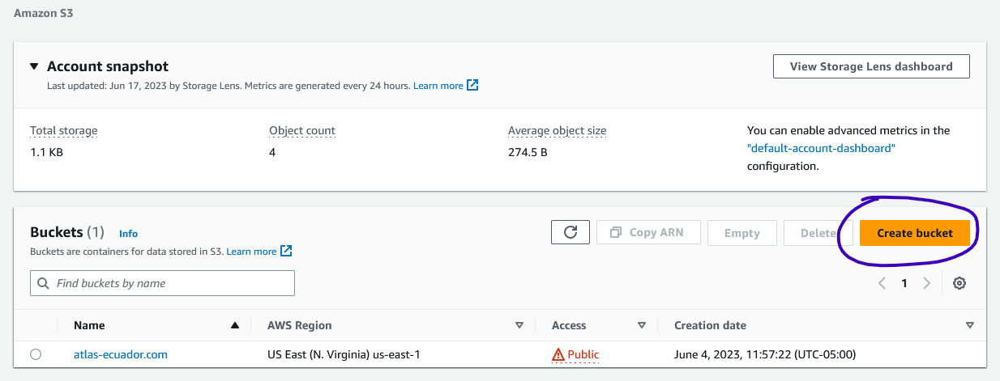

3. Agregar un nombre único del bucket
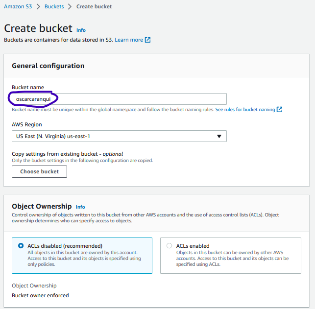
4. Dar permisos públicos al bucket y aceptamos la advetencia que nos da AWS
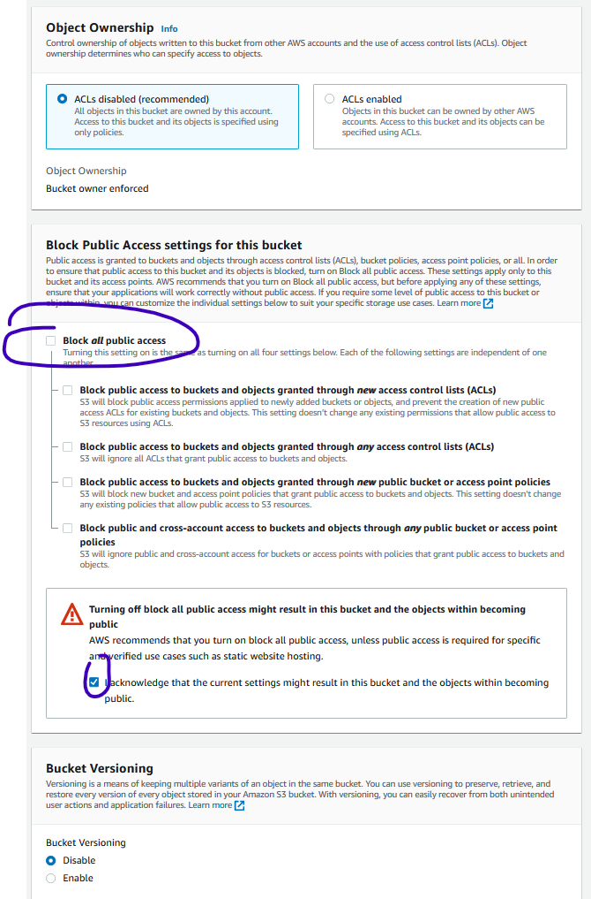
5. Finalmente creamnos el bucket
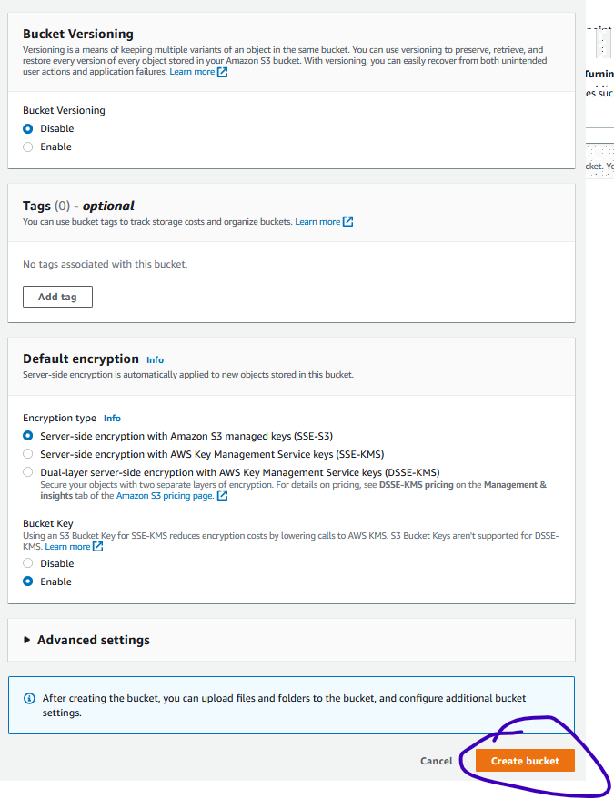
6. Ingresamos al bucket creado
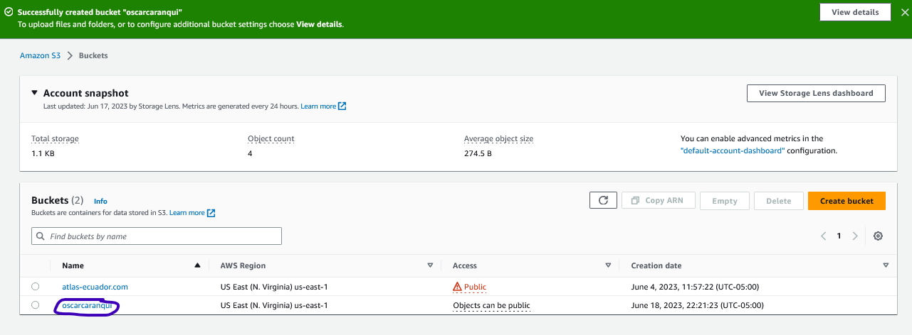
7. cargamos todos los archivos build generado de nuestro proyecto y le damos upload
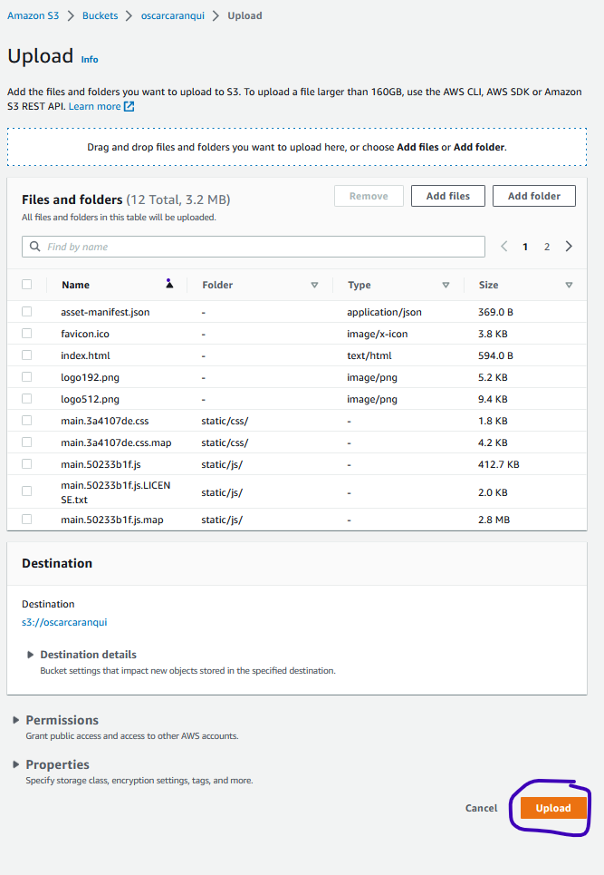
8. Agregamos una politica al bucket
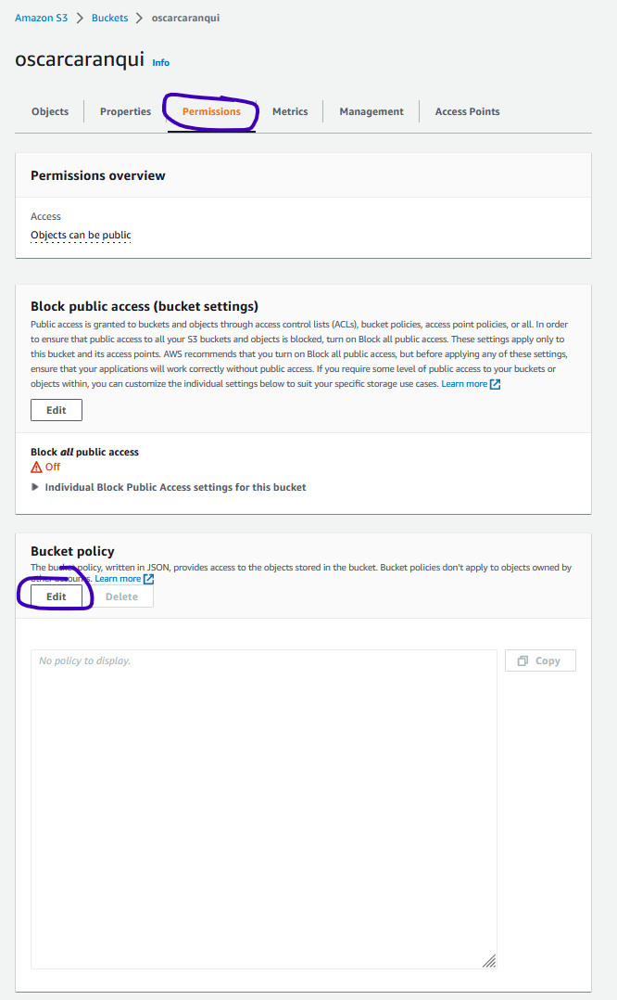
9. Luego damos click en save changes
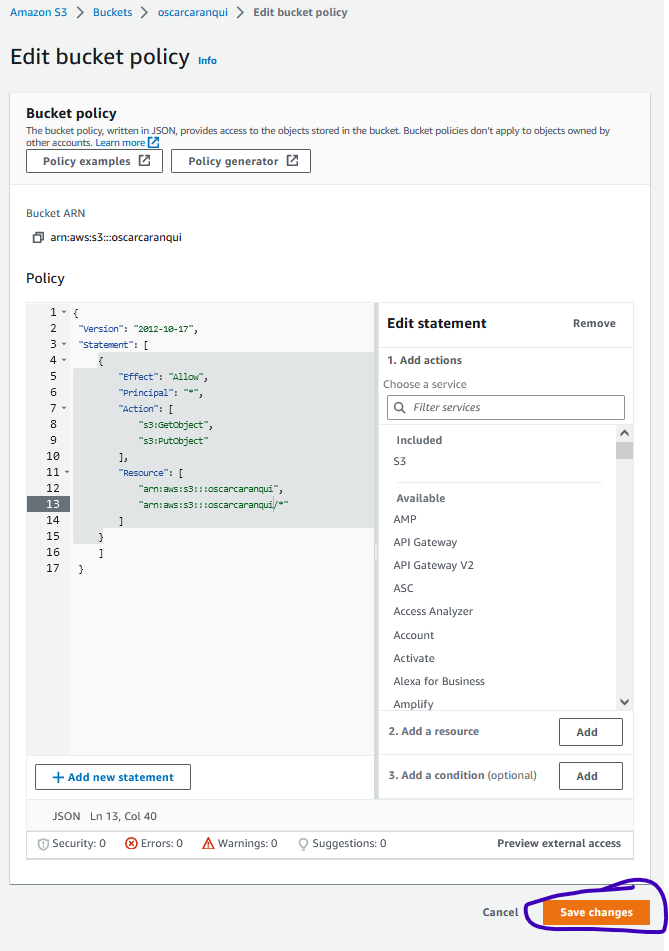
10. Agregamos una política de seguridad para compartir recursos
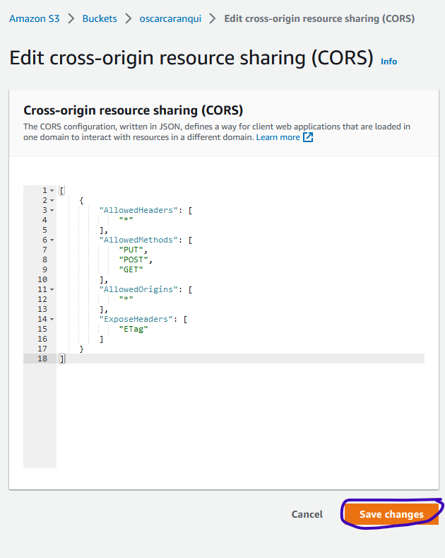
11. habilitamos el Static website hosting
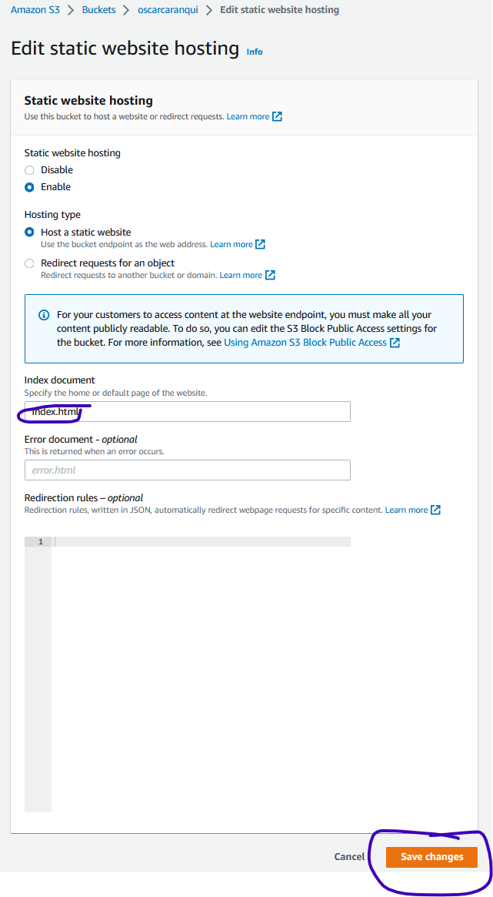
12. El bucket debería verse de la siguiente manera, con acceso publico
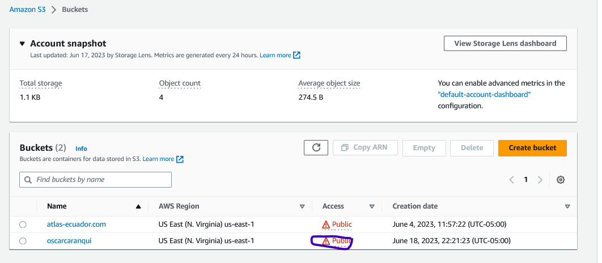

- Enlace al proyecto en AWS: [oscarcaranqui](http://oscarcaranqui.s3-website-us-east-1.amazonaws.com)